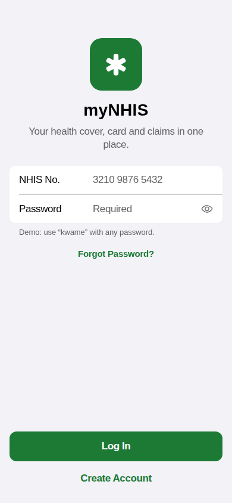
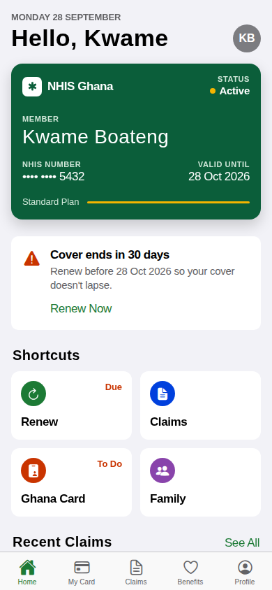
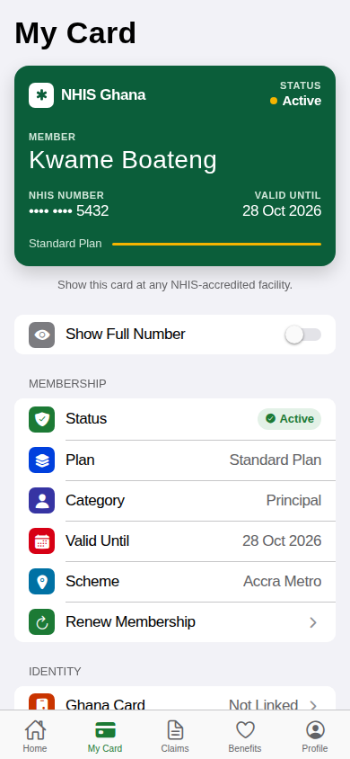
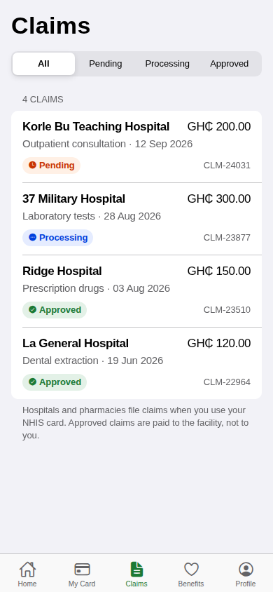
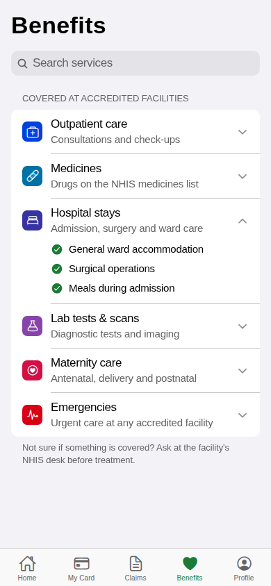
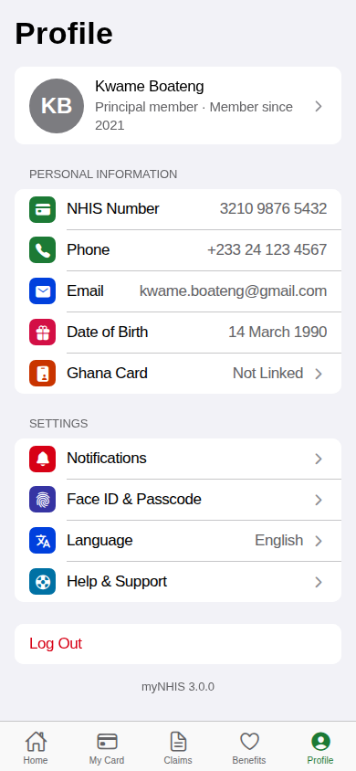
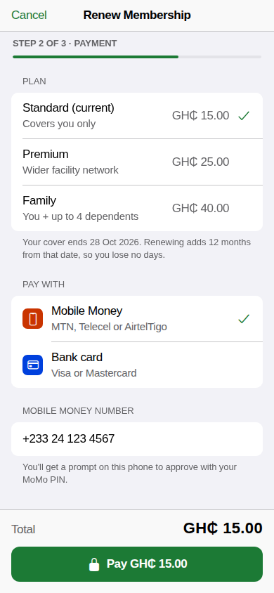
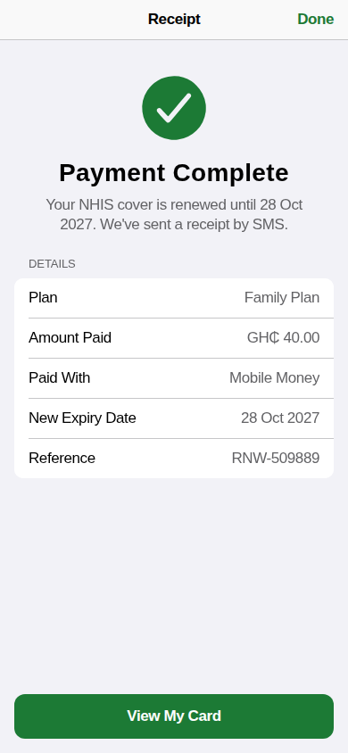
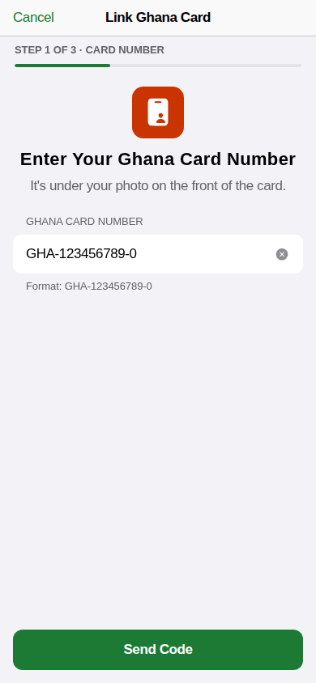
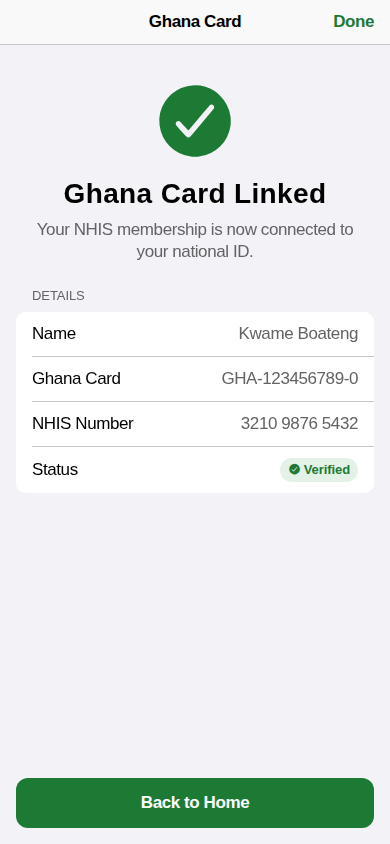

# myNHIS Mobile App (DCIT302 HCI Project)

A redesign of the NHIS membership mobile app, focused on improved usability, accessibility, and a modern user experience. Built as part of the DCIT302 Human-Computer Interaction course project.

## Table of Contents
- [Introduction](#introduction)
- [Features](#features)
- [Screenshots](#screenshots)
- [Installation](#installation)
- [Usage](#usage)
- [Technologies](#technologies)
- [Project Structure](#project-structure)
- [Contributing](#contributing)
- [License](#license)

## Introduction

myNHIS is a mobile app for Ghana’s National Health Insurance Scheme (NHIS) members. It simplifies membership management, renewals, claim tracking, and card linking, with a user-friendly interface designed using HCI principles.

## Features

- **Login/Sign Up:** Secure authentication using NHIS credentials. (Demo logic included for testing)
- **Home Dashboard:** Overview of membership, card expiry, and quick actions for renewal and claims.
- **Profile Management:** View member info, contact support, and logout.
- **Membership Details:** Review membership type, expiry, and manage dependents (add/remove family members).
- **Renew Membership:** Renew plans (Standard, Premium, Family), select payment method (Mobile Money, Bank Transfer), and view current membership status.
- **Track Claims:** See claim status, amounts, and hospital details.
- **Link Ghana Card:** Link your NHIS account to your Ghana Card for enhanced verification, with format and code validation.
- **Benefits Overview:** Browse covered healthcare services, drugs, hospitalization, lab tests, and more.
- **Accessible Design:** Built using HCI principles for simplicity, clarity, and ease of use.


## Screenshots

The look follows Apple's iOS Human Interface Guidelines: large titles, inset grouped lists, Settings-style icons, a segmented control, a Wallet-style membership pass, and tasks that open as sheets. One bottom tab bar (Home · My Card · Claims · Benefits · Profile) holds everything you do often; renewing and linking a Ghana Card open as sheets with **Cancel** and end on a receipt with **Done**.

| Login | Home | My Card | Claims | Benefits |
|---|---|---|---|---|
|  |  |  |  |  |

| Profile | Renew (sheet) | Receipt | Link Ghana Card (sheet) | Card linked |
|---|---|---|---|---|
|  |  |  |  |  |

Demo login: username `kwame` with any password.

### Design principles
- **Familiar to iPhone users.** Screens reuse patterns people already know from Settings, Wallet, Health and the App Store, so there is little to learn.
- **One way to get around.** Five labelled tabs; the selected tab turns green with a filled icon. Tasks open as sheets with **Cancel**, and end with **Done**.
- **Say it in plain words.** Every field has a visible label, errors appear right under the group that caused them, and buttons say what they do ("Pay GH₵ 15.00", "Send Code").
- **Status is never colour alone.** Every status badge has an icon and a word (Pending, Approved…).
- **Readable and tappable.** iOS text styles (17 pt body), Apple's increased-contrast system colours so all text meets WCAG AA, and 44 pt minimum tap targets.
- **Show progress.** Multi-step tasks show "Step 2 of 3 · Payment" and end on a receipt.

## Installation

### Prerequisites
- [Node.js](https://nodejs.org/) & [npm](https://www.npmjs.com/)
- [Expo CLI](https://docs.expo.dev/get-started/installation/)
- [Git](https://git-scm.com/)

### Steps
1. Clone the repository:
   ```bash
   git clone https://github.com/Kelly-Buabeng/DCIT302-HCIPROJECT-myNHISredesign.git
   cd DCIT302-HCIPROJECT-myNHISredesign/mynhis
   ```
2. Install dependencies:
   ```bash
   npm install
   ```
3. Start the development server using Expo:
   ```bash
   npx expo start
   ```
4. Scan the QR code with the Expo Go app (Android/iOS) or run on an emulator.

## Usage

- On launch, sign in with the demo NHIS number (e.g., `NHIS123456789`) or username (`kwame`, `emmanuel`, etc.).
- Navigate through the home dashboard to renew membership, track claims, and manage your account.
- Use the profile screen to view details or contact support.
- Link your Ghana Card in the dedicated screen using the required format for verification.

## Technologies

- **TypeScript** (99%): Core app logic and screens.
- **React Native** with [Expo](https://expo.dev/): Cross-platform mobile framework.
- **React Navigation:** Stack-based screen navigation.
- **Other** (0.8%): Configuration and assets.

## Project Structure

```
mynhis/
  ├── App.tsx                # Main app entry & navigation
  ├── index.ts               # Expo root registration
  ├── metro.config.js        # Metro bundler config
  ├── src/
  │   ├── screens/           # Main app screens (Login, Home, Profile, etc.)
  │   ├── theme/             # iOS-style tokens: system colours, text styles, spacing, radii
  │   ├── components/ui/     # Shared UI kit (NavBar, Group, ListRow, FormRow, SegmentedControl, TabBar…)
  │   ├── data/              # Dummy data for membership, claims, etc.
  │   └── types/             # TypeScript types for navigation and data
  └── assets/                # Images, icons, etc.
```

## Contributing

Contributions, suggestions, and feedback welcome!  
- Fork the repo, make your changes, and submit a pull request.
- For bugs or feature requests, open a [GitHub Issue](https://github.com/Kelly-Buabeng/DCIT302-HCIPROJECT-myNHISredesign/issues).

## License

> No explicit license found. Please contact the author for usage permissions.

---

**Author:** [Kelly-Buabeng](https://github.com/Kelly-Buabeng)  
**Course:** DCIT302 Human-Computer Interaction  
