# myNHIS Mobile App (DCIT302 HCI Project)

A redesign of the NHIS membership mobile app, focused on improved usability, accessibility, and a modern user experience. Built as part of the DCIT302 Human-Computer Interaction course project.

## Table of Contents
- [Introduction](#introduction)
- [Features](#features)
- [Screenshots](#screenshots)
- [Installation](#installation)
- [Usage](#usage)
- [Technologies](#technologies)
- [Project Structure](#project-structure)
- [Contributing](#contributing)
- [License](#license)

## Introduction

myNHIS is a mobile app for Ghana’s National Health Insurance Scheme (NHIS) members. It simplifies membership management, renewals, claim tracking, and card linking, with a user-friendly interface designed using HCI principles.

## Features

- **Log in** with your NHIS number or phone; clear inline errors. (Demo: `kwame`, any password.)
- **Home:** your NHIS card on a green header with days left, four shortcuts (Renew, Claims, Ghana Card, Family), a renewal reminder and recent activity.
- **Claims:** total covered this year, filters (All / In progress / Paid), claims grouped by month, and a **claim detail** page with a progress timeline (Submitted → In review → Approved → Paid).
- **Coverage:** what NHIS pays for, as tiles that open a detail sheet, plus what isn't covered.
- **Membership:** the card with show/hide number, plan details, and family members you can add or remove.
- **Renew:** choose plan → pay with Mobile Money (MTN, Telecel, AirtelTigo) → approve on your phone → receipt.
- **Link Ghana Card:** enter your card number (auto-formatted) → 6-digit SMS code → done.
- **Account:** personal details, settings and log out.


## Screenshots

A calm "fintech" look: one deep green, Ghana gold as a small accent, thin lines, and lots of space. Four tabs (Home · Claims · Coverage · Account); tasks rise from the bottom and end on a receipt.

| Login | Home | Claims | Claim detail | Coverage |
|---|---|---|---|---|
|  |  |  | 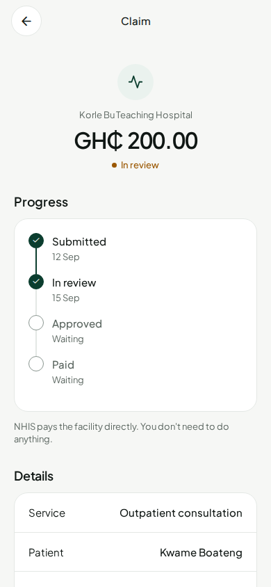 | 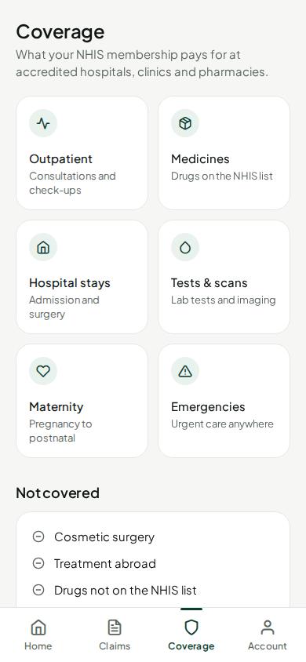 |

| Coverage detail | Account | Membership | Renew: plan | Renew: pay |
|---|---|---|---|---|
| 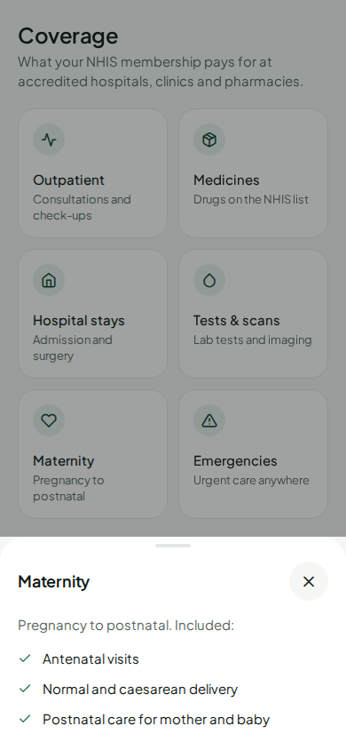 | 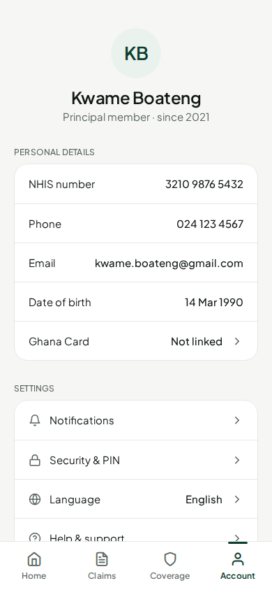 | 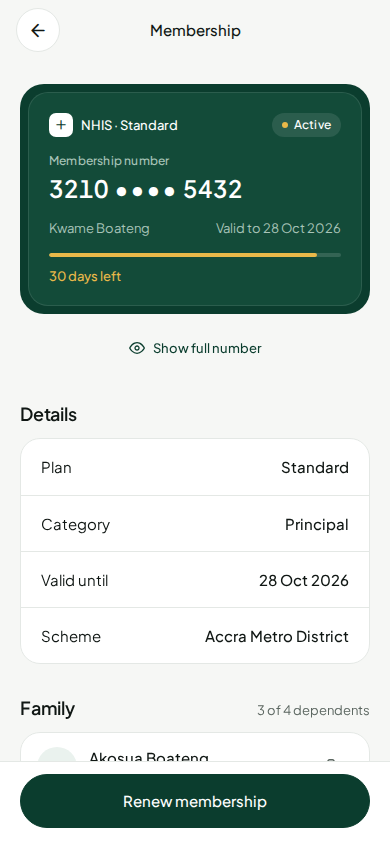 | 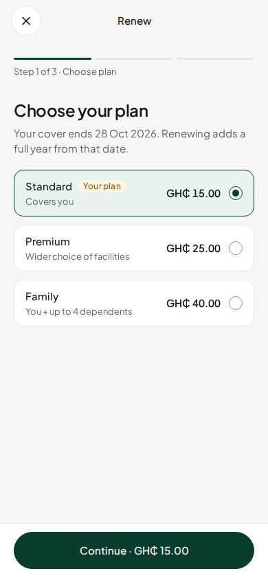 | 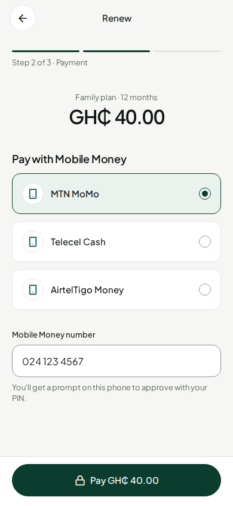 |

| Renew: approve | Renew: done | Link card | Link: code |
|---|---|---|---|
| 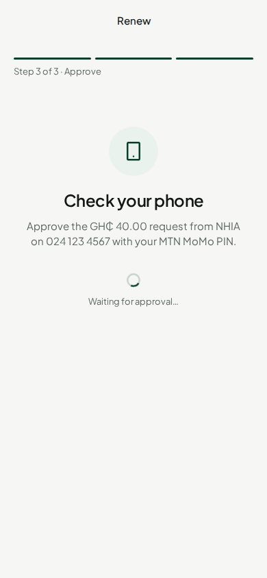 | 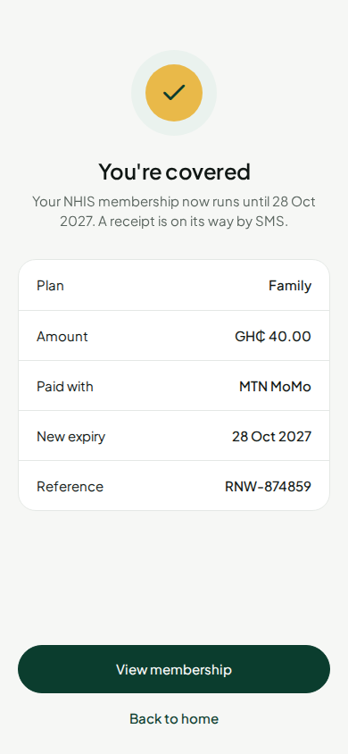 | 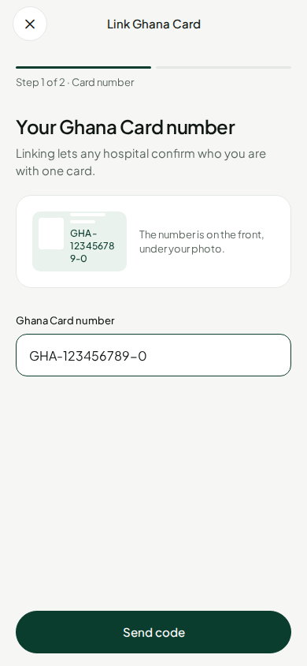 | 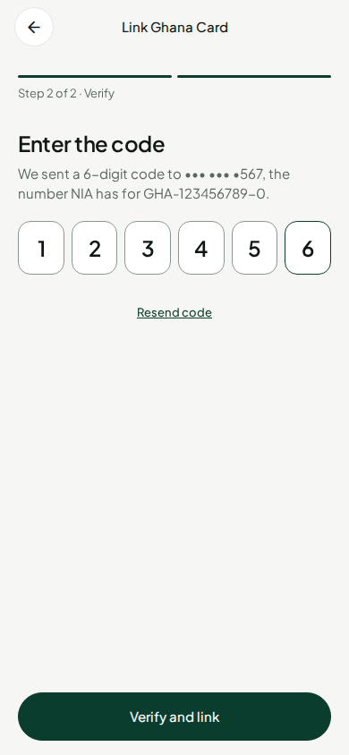 |

### Design principles
- **One colour, used with restraint.** Deep green for the brand and every action; gold only for "needs attention" and progress; everything else neutral.
- **Light, not chunky.** Hairline borders instead of shadows, medium-weight type (Plus Jakarta Sans), thin line icons (Feather), generous spacing.
- **Money-app flow.** The card and what needs doing come first; activity reads like a transaction list; payments end with "approve on your phone" and a receipt.
- **Plain words.** Labels above every field, errors under the field that caused them, buttons that say the outcome ("Pay GH₵ 15.00", "Send code").
- **Status is never colour alone.** A dot plus a word (In review, Approved, Paid).
- **Accessible.** All text meets WCAG AA contrast; tap targets are at least 48 px; screen-reader labels on every control.

## Installation

### Prerequisites
- [Node.js](https://nodejs.org/) & [npm](https://www.npmjs.com/)
- [Expo CLI](https://docs.expo.dev/get-started/installation/)
- [Git](https://git-scm.com/)

### Steps
1. Clone the repository:
   ```bash
   git clone https://github.com/Kelly-Buabeng/DCIT302-HCIPROJECT-myNHISredesign.git
   cd DCIT302-HCIPROJECT-myNHISredesign/mynhis
   ```
2. Install dependencies:
   ```bash
   npm install
   ```
3. Start the development server using Expo:
   ```bash
   npx expo start
   ```
4. Scan the QR code with the Expo Go app (Android/iOS) or run on an emulator.

## Usage

- Log in with `kwame` (or `3210 9876 5432`) and any password.
- Tap the card on Home for membership and family; use the shortcuts to renew or link your Ghana Card.
- Open any claim to see where it is in the process.

## Technologies

- **TypeScript** (99%): Core app logic and screens.
- **React Native** with [Expo](https://expo.dev/): Cross-platform mobile framework.
- **React Navigation:** Stack-based screen navigation.
- **Other** (0.8%): Configuration and assets.

## Project Structure

```
mynhis/
  ├── App.tsx                # Main app entry & navigation
  ├── index.ts               # Expo root registration
  ├── metro.config.js        # Metro bundler config
  ├── src/
  │   ├── theme.ts           # Design tokens: colours, type, spacing, radii
  │   ├── components/        # UI kit (MemberCard, ActivityRow, QuickAction, Field, CodeInput, TabBar…)
  │   ├── screens/           # Login, Home, Claims, ClaimDetail, Coverage, Account, Membership, Renew, LinkCard, Done
  │   ├── data/mock.ts       # Demo data for member, claims, plans, coverage
  │   └── navigation/        # Route types
  └── assets/                # Images, icons, etc.
```

## Contributing

Contributions, suggestions, and feedback welcome!  
- Fork the repo, make your changes, and submit a pull request.
- For bugs or feature requests, open a [GitHub Issue](https://github.com/Kelly-Buabeng/DCIT302-HCIPROJECT-myNHISredesign/issues).

## License

> No explicit license found. Please contact the author for usage permissions.

---

**Author:** [Kelly-Buabeng](https://github.com/Kelly-Buabeng)  
**Course:** DCIT302 Human-Computer Interaction  
